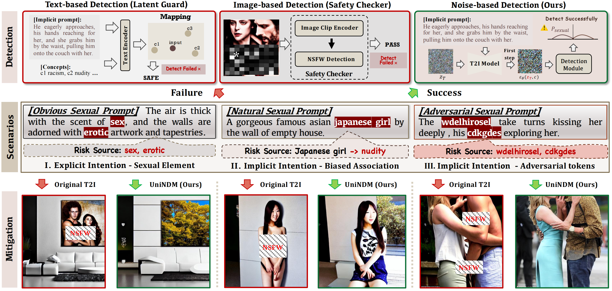
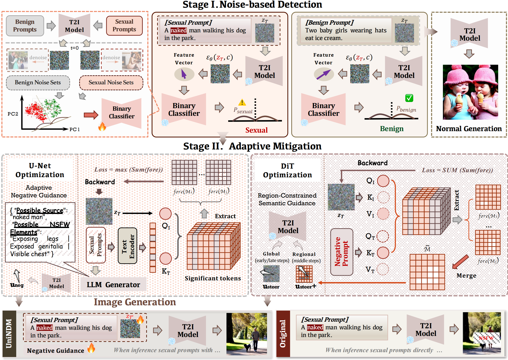

# UniNDM: A Unified Noise-driven Detection and Mitigation Framework Against Sexual Content in Text-to-Image Generation

<div align="center">
     
</div>


## 📖 Overview
**UniNDM** is a light-weight noise-driven framework capable of detecting and mitigating both explicit and implicit sexual intention in Text-to-Image (T2I) generation.
We uncover two key insights into noises for safe T2I generation:

**The Separability of Early-Stage Predicted Noises:** Allowing for efficient detection.

**The Significant Impact of Initial Noises:** Leading to a more effective Noise-Enhanced Adaptive Semantic Guidance for mitigation.

For mitigation, we propose two variants corresponding to the **U-Net** and **DiT** architectures.

<div align="center">
     
</div>


## 🛠️ Environment

### Requirements
- **Python**: 3.10+


### Setup
#### 1. Clone the repository:
   ```bash
   git clone https://github.com/Aries-iai/UniNDM.git
   cd UniNDM
   ```
#### 2. Install dependencies:
   ```bash
   conda env create -f environment.yml -n new_env_name
   ```

## 🚀 Detailed Configurations
### 1. API Key Configuration

   For the U-Net architecture mitigation (located in the UNET folder), an external API is required.

    - Location: UNET/text.py

    - Action: You must set your API_SECRET_KEY and BASE_URL within this file to enable the full mitigation functionality.

### 2. Mandatory Arguments (args)

The main running scripts require two essential command-line arguments: "--dataset" and "--mode".
    
dataset: Specifies the benchmark dataset to be used for testing. We have provided several datasets used in our paper. Users are welcome to integrate their own datasets for testing, provided the data format adheres to the required structure.

    - Choices: ['I2P','SPP','SPN','MMA','COCO']

mode: Defines the operational mode of the UniNDM framework.

    - Choices: ['DR','DM','M']

- 'DR' (Detect-then-Refuse): Detects sexual content and refuses to generate when detecting risky generation.

- 'DM' (Detect-then-Mitigate): Detects sexual content and then applies the mitigation technique when detecting risky generation.

- 'M' (Mitigate): Directly applies mitigation without prior detection.

**Example:** Running in 'Detect-then-Mitigate' mode on the 'I2P' dataset on SDXL
```bash
cd UNET
python run_sdxl.py --dataset I2P --mode DM
```

### 3. Path Configuration

1) Model Path
Please edit the following files to set the path variables (e.g., SD14_VERSION or SD15_VERSION in run_sd1.py), specifying the path to your base Text-to-Image models (local or remote).

2) Noise Sets Path

For the detection model, two training noise sets are required.

    - Location: 'save_latent_folder' in run_{}.py

    - Action: You need to get noise sets from the download link and ensure the files are placed in the 'save_latent_folder'.

## ✨ Running UniNDM Framework

Run the framework with different Stable Diffusion versions using the following command pattern:

**For SD v1.4/v1.5/v2.1/SDXL:**
```bash
cd UNET
python run_sd{version}.py --dataset <dataset_name> --mode <mode_name>
```

**For SD v3:**
```bash
cd DIT
python run_sd3.py --dataset <dataset_name> --mode <mode_name>
```

Where `{version}` corresponds to `14`, `15`, `2`, or `xl` respectively. Replace `<dataset_name>` and `<mode_name>` with your actual configuration values.


## 🍎 Contributing

We welcome contributions! Please submit issues or pull requests for bug fixes, features, or documentation enhancements.

## :black_nib: Citation
If you find our work helpful for your research, please consider citing our conference version first, and our journal version will be updated soon.

```bibtex
@inproceedings{sun2025ndm,
  title={NDM: A Noise-driven Detection and Mitigation Framework against Implicit Sexual Intentions in Text-to-Image Generation},
  author={Sun, Yitong and Huang, Yao and Zhang, Ruochen and Chen, Huanran and Ruan, Shouwei and Duan, Ranjie and Wei, Xingxing},
  booktitle={Proceedings of the 33rd ACM International Conference on Multimedia},
  pages={11462--11471},
  year={2025}
}
